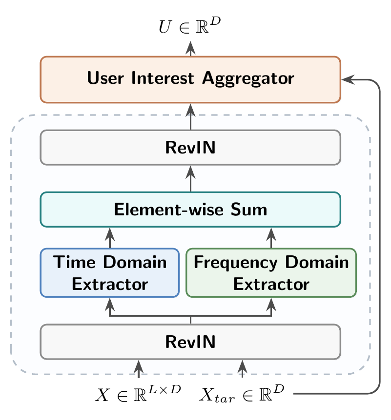
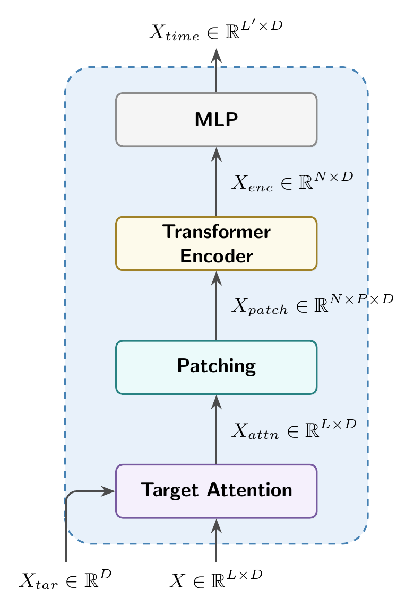
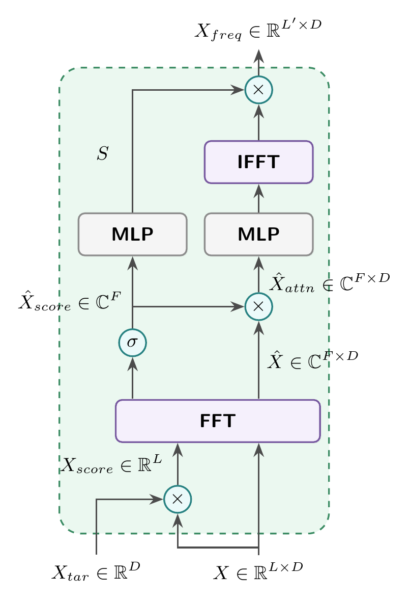

# FEDIN: Frequency-Enhanced Deep Interest Network for Click-Through Rate Prediction

This repository is the official PyTorch implementation of our SIGIR 2026 short paper.
<p align="center">
  
  
  
</p>

## Catalogue <br> 
* [1. Getting Started](#getting-started)
* [2. Train/Test](#trainTest)
* [3. Results](#results)

## Getting Started

1. Install the dependencies:
- cuda 11.7
- python 3.9.18
- pytorch 1.10.1
- numpy 1.24.4
- fuxictr 2.3.1

```shell
pip install -r requirements.txt
```

2. Download Datasets:
- [Tmall](https://tianchi.aliyun.com/dataset/42)
- [Taobao](https://tianchi.aliyun.com/dataset/649)
- [Alipay](https://tianchi.aliyun.com/dataset/53)

3. Preprocess Datasets:

To preprocess Tmall:
```shell
python data_preprocess/preprocess_tmall.py
```

## Train/Test

To train/test FEDIN on Tmall:
```
python run_expid.py --expid FEDIN_tmall --gpu 0 --seed [RANDOM_SEED]
```

## Results
For this repository, the expected performance is:

<table>
    <thead>
        <tr>
            <th rowspan="2">Model</th>
            <th colspan="2">Tmall</th>
            <th colspan="2">Alipay</th>
            <th colspan="2">Taobao</th>
        </tr>
        <tr>
            <th>GAUC</th>
            <th>AUC</th>
            <th>GAUC</th>
            <th>AUC</th>
            <th>GAUC</th>
            <th>AUC</th>
        </tr>
    </thead>
    <tbody>
        <tr>
            <td>Sum Pooling</td>
            <td>0.8978</td>
            <td>0.8873</td>
            <td>0.8557</td>
            <td>0.8535</td>
            <td>0.9345</td>
            <td>0.9337</td>
        </tr>
        <tr>
            <td>DIN</td>
            <td><u>0.9547</u></td>
            <td><u>0.9518</u></td>
            <td>0.8897</td>
            <td>0.8832</td>
            <td><u>0.9689</u></td>
            <td><u>0.9664</u></td>
        </tr>
        <tr>
            <td>DIEN</td>
            <td>0.9237</td>
            <td>0.9157</td>
            <td>0.8980</td>
            <td>0.8953</td>
            <td>0.9443</td>
            <td>0.9442</td>
        </tr>
        <tr>
            <td>SASRec</td>
            <td>0.9183</td>
            <td>0.9246</td>
            <td>0.9238</td>
            <td><u>0.9312</u></td>
            <td>0.9583</td>
            <td>0.9584</td>
        </tr>
        <tr>
            <td>BERT4Rec</td>
            <td>0.9103</td>
            <td>0.9157</td>
            <td>0.9179</td>
            <td>0.9189</td>
            <td>0.9523</td>
            <td>0.9535</td>
        </tr>
        <tr>
            <td>GRU4Rec</td>
            <td>0.9210</td>
            <td>0.9242</td>
            <td><u>0.9268</u></td>
            <td>0.9289</td>
            <td>0.9618</td>
            <td>0.9638</td>
        </tr>
        <tr>
            <td>BST</td>
            <td>0.9233</td>
            <td>0.9269</td>
            <td>0.9264</td>
            <td>0.9285</td>
            <td>0.9562</td>
            <td>0.9576</td>
        </tr>
        <tr>
            <td>DIFF</td>
            <td>0.8513</td>
            <td>0.8618</td>
            <td>0.8962</td>
            <td>0.8995</td>
            <td>0.9463</td>
            <td>0.9475</td>
        </tr>
        <tr class="green-bg">
            <td>FEDIN (Ours)</td>
            <td><b>0.9658*</b></td>
            <td><b>0.9666*</b></td>
            <td><b>0.9335*</b></td>
            <td><b>0.9320*</b></td>
            <td><b>0.9740*</b></td>
            <td><b>0.9729*</b></td>
        </tr>
    </tbody>
</table>

## Citation
If you find this repository useful, please cite our paper:
```bibtex
@inproceedings{dai2026fedin,
  title = {FEDIN: Frequency-Enhanced Deep Interest Network for Click-Through Rate Prediction},
  author = {Dai, Zenan and Wang, Jinpeng and Pan, Junwei and Liu, Dapeng and Xiao, Lei and Xia, Shu-Tao},
  booktitle = {Proceedings of the 49th International ACM SIGIR Conference on Research and Development in Information Retrieval},
  pages = {3670--3675},
  year = {2026},
  doi = {10.1145/3805712.3809861}
}
```

## Acknowledgements
Our code is based on the implementation of [FuxiCTR].

[FuxiCTR]:https://github.com/reczoo/FuxiCTR
